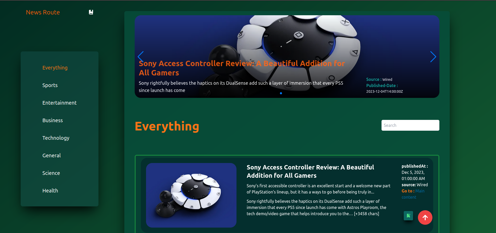
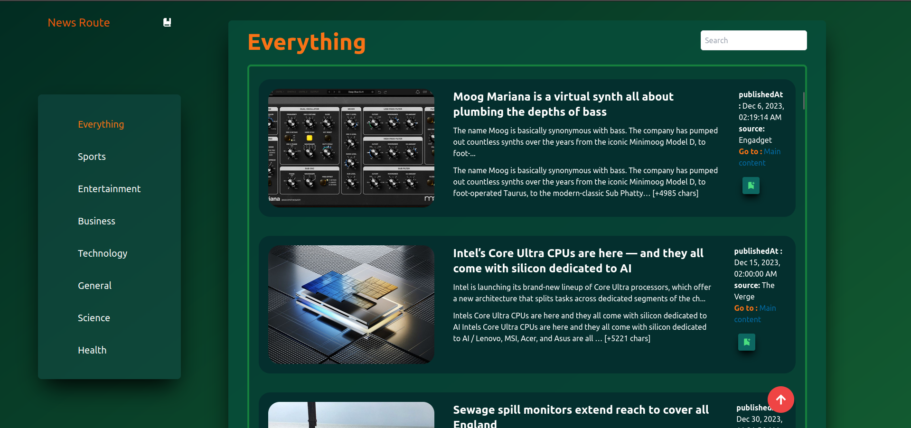
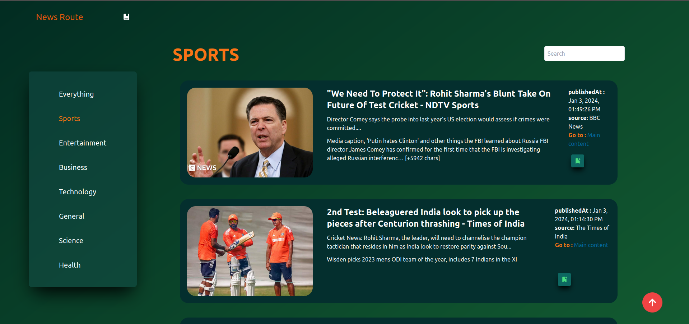
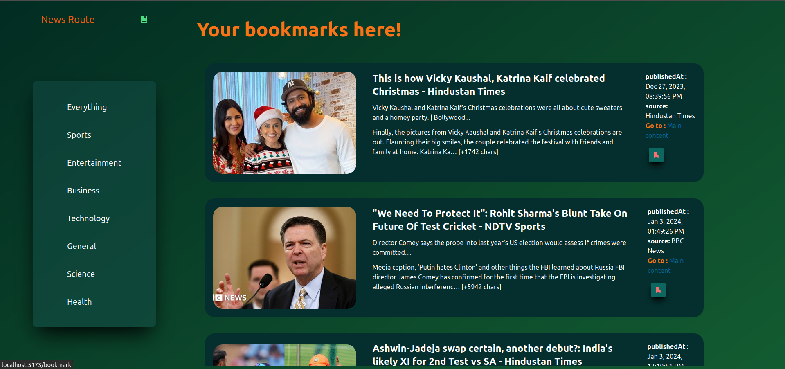

# NewsRoute

NewsLok is a React-based News app that allows you to stay updated with the latest news articles. It comes with various features to enhance your news reading experience.



## Features

### 1. Fetching News

- Integration with a news API to fetch the latest news articles.
- Support for different news categories (e.g., technology, sports, politics).
- Infinite scroll for continuous news loading.

### 2. Carousel Display

- Implementation of a carousel to showcase featured news articles.
- Dynamic display of the news articles in the carousel.
- Customizable carousel settings for user preferences.

### 3. User Interaction

- User-friendly interface for a seamless news reading experience.

### 4. Search Functionality

- Integration of a search bar for users to find specific news articles.
- Filtering options of major categories(sports, business, technology etc).

## Getting Started

Follow these steps for set up and run the project loally:

### Prerequisites

- Node.js and npm installed on your machine.
- An API key from NewsAPI.

### Installation

1. CLone the repository:

   ```bash
   git clone https://github.com/anchalraj31082004/newsroute
   ```
2. Navigate to the project directory:

    ```bash
    cd newsroute
    ```

3. Install dependencies:

    ```bash
    npm install
    ``` 

4. Rename the `.env.sample` to `.env` file in the root directory and add your API key:

    ```env
    VITE_API_BASE_URL="https://newsapi.org/v2"
    VITE_API_KEY="{Your_API_KEY_FROM_NewsAPI}"
    ```

    Replace `YOUR_API_KEY_FROM_NewsAPI` with your actual API key.

5. Start the development server:

    ```bash
    npm run dev
    ```

6. Open your browser and visit http://localhost:5173 to view the app.   

### Extra screenshots








# Deployment Considerations

## NewsAPI.org Limitations

Newsroute relies on the NewsAPI.org service to fetch real-time news data.
However, please note that the NewsAPI.org free tier is intended for development purposes only.
Additionally, CORS (Cross-Origin Resource Sharing) is only enabled for localhost in the free tier.

## Deploying to Production

To deploy NewsRoute to a production environment, you'll need to upgrade to a paid plan on NewsAPI.org to remove development restrictions and enable CORS for your production domain.

1. **Upgrade NewsAPI.org Plan:**
   Visit [NewsAPI.org Pricing](https://newsapi.org/pricing) and choose a plan that suits your application's needs. Follow the instructions to upgrade your account.

2. **Configure CORS:**
   After upgrading, configure CORS settings on NewsAPI.org to allow requests from your production domain. This ensures that your deployed app can fetch news data successfully.

3. **Update API Key:**
   Replace the NewsAPI.org API key in your app with the new key associated with your upgraded plan.

## That is why I didn't deployed, you set it up in localhost or you can deploy it for your own experience.

## Demo video
https://github.com/anchalraj31082004/newsroute/assets/126651793/d95f9cc3-26a5-4c21-8525-66984bb48206
